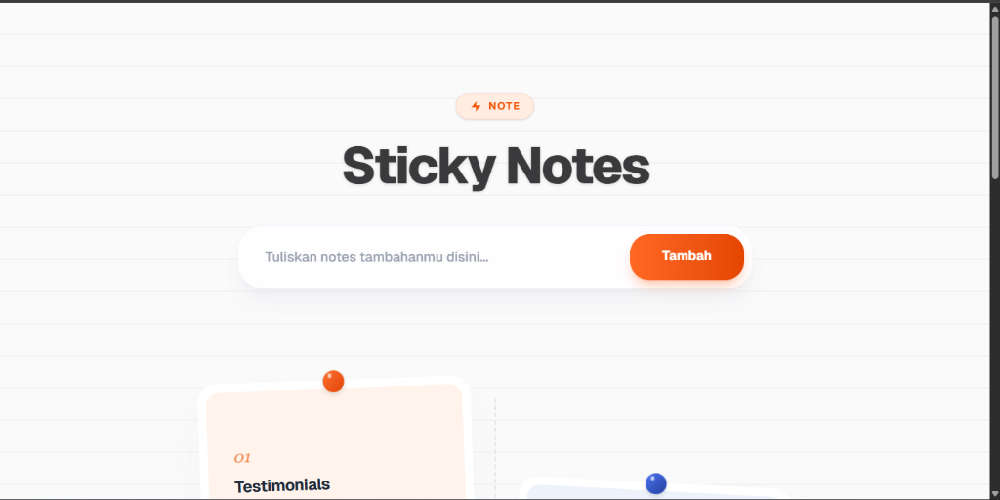
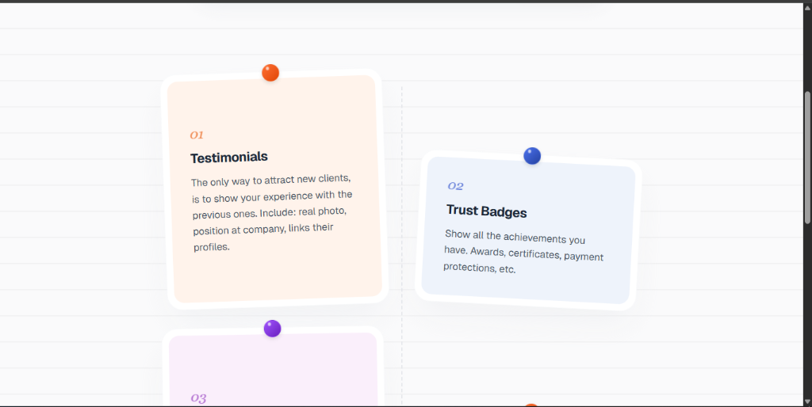
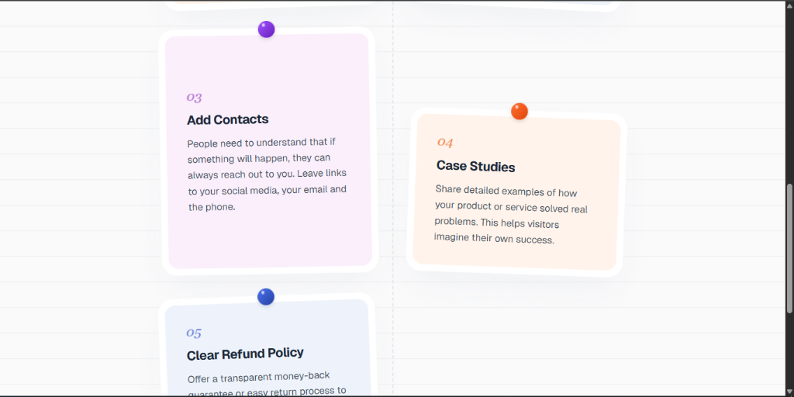
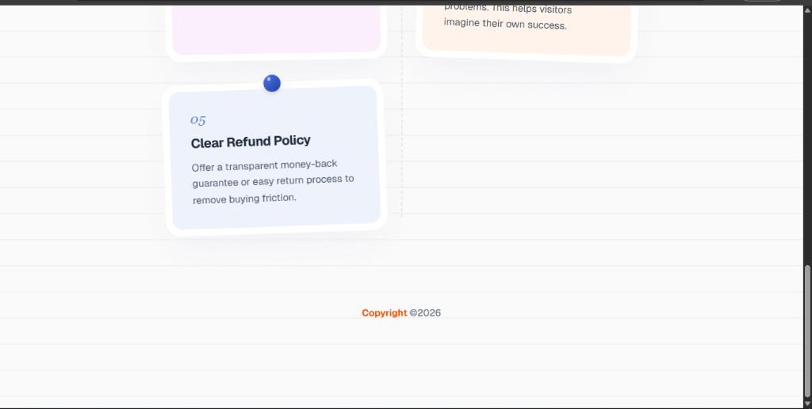

# Sticky Notes

Design simple buat latihan Next JS dasar yang interface nya bergaya Sticky Notes. Dibangun pakai Next.js dipadukan dengan Tailwind CSS murni untuk desain yang clean dan simple.

## Preview Tampilan

<div align="center">
  
  <br/><br/>
  
  <br/><br/>
  
  <br/><br/>
  
</div>

## Fitur Utama

- Tampilan notes dengan susunan zigzag (staggered) biar lebih dinamis.
- Efek bentuk 3D pada pin dan bayangan menggunakan utility murni dari Tailwind CSS.
- Elemen form menggunakan gaya glassmorphism.
- Desain sepenuhnya responsif, cocok untuk layar HP maupun laptop.

## Teknologi yang Dipakai

- Next.js (App Router)
- Tailwind CSS

## Cara Menjalankan Project

Install dulu dependencies (kalau belum dijalankan):

```bash
npm install
```

Setelah itu, jalankan development server:

```bash
npm run dev
# atau
yarn dev
# atau
pnpm dev
```

Tinggal buka [http://localhost:3000](http://localhost:3000) di browser untuk melihat hasilnya. Kalau mau edit-edit, file utamanya ada di `src/app/page.js`.

---
Copyright © 2026.

