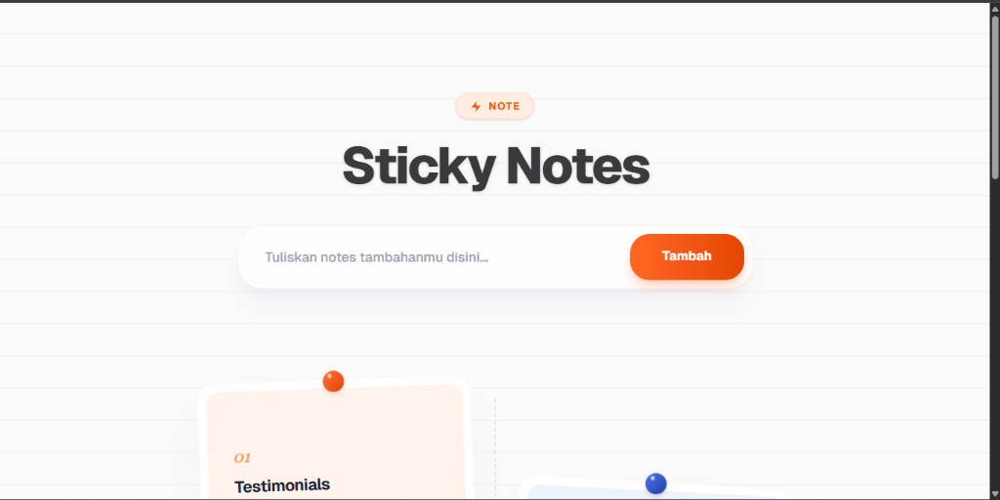
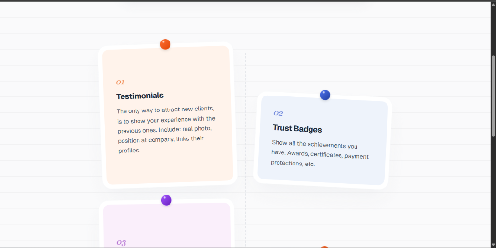
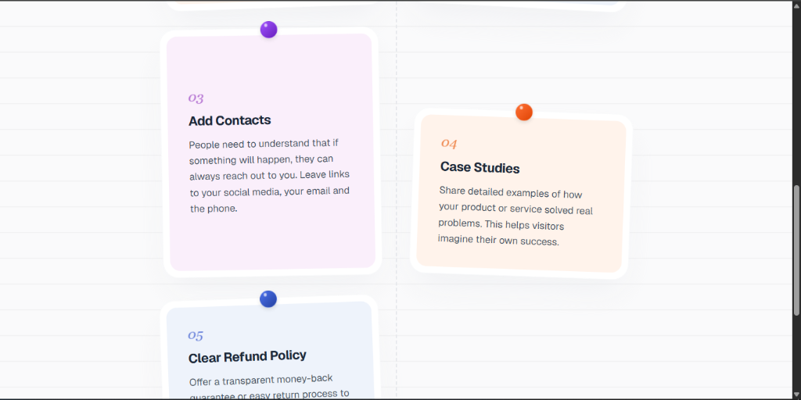
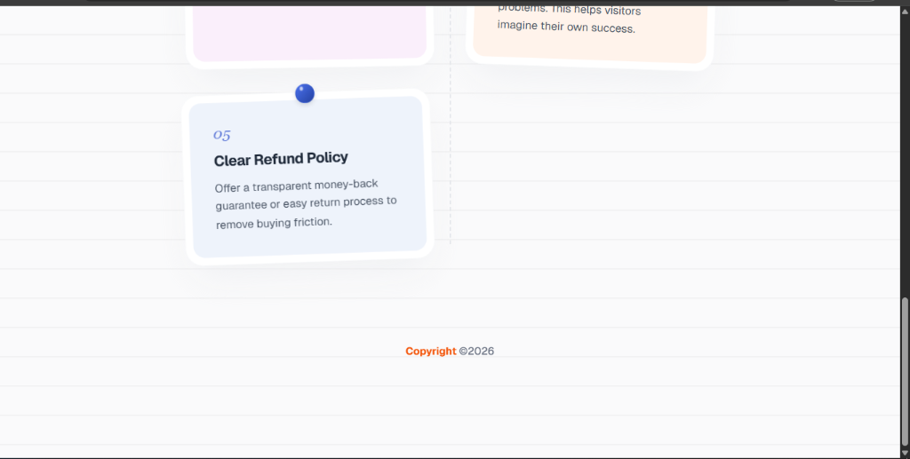

# 📌 Sticky Notes

Aplikasi catatan tempel (Sticky Notes) interaktif yang dibangun pakai **Next.js** dan **Tailwind CSS**. Bukan cuma tampilan doang — aplikasi ini udah punya fitur lengkap: **Tambah, Edit, dan Hapus** catatan, dengan data yang tersimpan otomatis di **localStorage** browser.

## Preview Tampilan

<div align="center">
  
  <br/><br/>
  
  <br/><br/>
  
  <br/><br/>
  
</div>

## Fitur Utama

- ✏️ **CRUD Lengkap** — Tambah, Edit, dan Hapus catatan lewat modal form yang rapi.
- 💾 **Penyimpanan Lokal (localStorage)** — Data catatan otomatis tersimpan di browser, jadi nggak hilang walau di-refresh.
- 🎨 **Warna Acak Otomatis** — Setiap catatan baru dapet warna tema random (orange, blue, atau purple) biar makin colorful.
- 📐 **Layout Zigzag (Staggered)** — Susunan notes bergaya zigzag yang bikin tampilan lebih dinamis dan nggak monoton.
- 📌 **Efek Pin 3D** — Pin (thumbtack) di atas setiap note dengan gradient dan shadow realistis.
- 🪟 **Modal Glassmorphism** — Form input tampil dalam modal popup dengan efek blur yang modern.
- 📱 **Fully Responsive** — Tampilannya enak dilihat di HP maupun laptop/desktop.
- ⚡ **Konfirmasi Hapus** — Ada dialog konfirmasi sebelum catatan dihapus biar nggak kecelakaan.

## Teknologi yang Dipakai

| Teknologi | Versi |
|---|---|
| Next.js (App Router) | 16.2.2 |
| React | 19.2.4 |
| Tailwind CSS | 4.x |

## Struktur File Utama

```
src/
└── app/
    └── page.js        # Halaman utama (semua logika CRUD ada di sini)
```

## Cara Menjalankan Project

1. **Install dependencies** (kalau belum):

```bash
npm install
```

2. **Jalankan development server:**

```bash
npm run dev
# atau
yarn dev
# atau
pnpm dev
```

3. Buka [http://localhost:3000](http://localhost:3000) di browser.

> Kalau mau edit-edit, file utamanya ada di `src/app/page.js`.

## Cara Pakai

1. Klik tombol **"+ Tambah Catatan Baru"** untuk bikin catatan.
2. Isi **Judul** dan **Isi Catatan** di modal yang muncul, lalu klik **Simpan**.
3. Klik tombol **Edit** di catatan untuk mengubah isinya.
4. Klik tombol **Hapus** untuk menghapus catatan (ada konfirmasi dulu).

---

Copyright © 2026.
